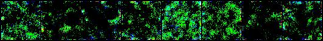

# visual_imagery_reconstruction

### by Sawyer Figueroa
---

### An exploration and implementation of decoding visual imagery from brain fMRI signals.
---
## Overview

In this repository, I explored the implementation of neural networks in PyTorch, specifically in the context
of generative diffusion models. I then applied a form of neural network guidance, prompted by segments of fMRI data
experimentally recorded from subjects looking at a set of images. Ultimately, the goal is to somewhat reproduce high quality images based off of brain activity in response to these images.

The dataset that fueled this project is [BOLD5000](https://bold5000-dataset.github.io/website/). This large-scale dataset
includes fMRI recordings from 4 unique subjects, who each observed 5,254 images drawn from popular computer vision datasets (SUN, COCO, ImageNet).

In essence, a standard hemodynamic response function was fit to raw fMRI data recorded during the image viewing tasks. A generalized linear model performed this fit for each voxel in the data, providing
a single parameter *beta* to represent the explained variance in the signal. 1D vectors of *beta* values were extracted from regions of interest (ROIs) within the brain and used as guidance for training a custom diffusion model
to generate images.

The diffusion model consists of a neural network with U-Net architecture meant to predict the amount of noise from a given input image. This neural network is trained by adding varying amounts of noise to training images
and having the network iteratively predict the noise in the image. The model was first trained unconditionally on all unique images in the BOLD5000 dataset using this paradigm. Afterwards, the fMRI *beta* values from 
ROIs corresponding to each image were fed into the model at uniform points throughtout the downsampling and upsampling process of the U-Net model during training. The final model takes in a set fMRI *beta* values and generates
an image guided by them.

The advantage to using this diffusion model in comparison to simpler decoding models is that it produces higher quality visually comprehensible images that make use of modern AI techniques to fill in gaps of information. Many other methods
fail to gain sufficient information to generate full images from brain recordings alone, resulting in blurry, undefined images. The goal is to bridge this gap through generative AI and explore its possible applications to Neuroscience.

---
## Use

To use and train the model on your own dataset of images, run the following code like so:
```
from utils.preprocessing import create_loader
from training.model import train_unconditional_diffusion

data_settings = {
'image_size' = 64,
'batch_size' = 12,
'data_path' = '...'
}

train_setttings = {
'epochs': 10,
'lr':3e-4,
'image_size':64,
'device':'cuda',
'model_in':None
}

data_loader = create_loader(**data_settings)
train_unconditional_diffusion(data_loader, **settings)
```

Pre-trained models can be found and loaded under "results/all_imgs/models" or "results/conditional/models" using:
```
from training.model import UNet
import torch

# establish file path and device
device = 'cuda'
model_in = 'results/all_imgs/models/unconditional_diffusion_500_epochs.pt'

model = UNet().to(device)
checkpoint = torch.load(model_in)
model.load_state_dict(checkpoint['model_state_dict'])
```

The hyperparameters in this example are the ones used during training of the model included in this repository. If training the model on your own dataset, changing them might help to optimize performance.

---
## Results

After training the unconditional model for 500 epochs, the following generations were created:



The conditional model including the fMRI data as input produced the following results compared to input:


---
## Applications

Advancements in AI have been rapid and impactful in recent years. The opportunities for these tools in conjunction with large datasets is enormous, especially in Neuroscience. Neural decoding in combination with data generation
has the potential to reveal incredible insights about human cognition and provide utility to advances in Brain Computer Interfaces.

If you want to contribute or share similar interests, don't hesitate to reach out. Thank you.

---
## References

[BOLD5000 datast](https://www.nature.com/articles/s41597-019-0052-3)
[fMRI Decoding Explanation](https://cbmm.mit.edu/video/fmri-bootcamp-part-6-classification-3510)
[Diffusion Process/Implementation](https://arxiv.org/pdf/2006.11239.pdf)
[Model Explanation Video](https://www.youtube.com/watch?v=HoKDTa5jHvg&t=1774s)
[OpenAI Paper](https://arxiv.org/pdf/2105.05233.pdf)

